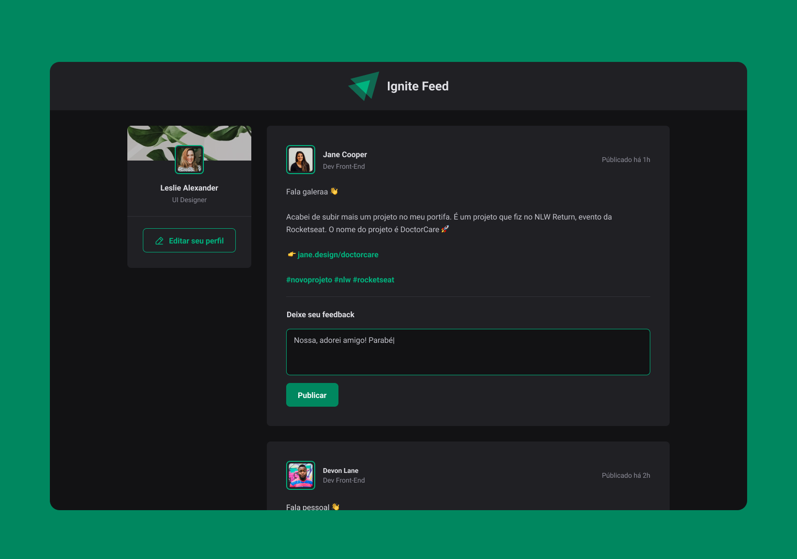

  

---

  

## 🖥️ Sobre o Projeto

Neste repositório está hospedado uma aplicação web responsiva utilizando as funcionalidades da biblioteca React para construção de um layout dinâmico para um feed de posts com comentários. Este projeto foi desenvolvido durante desafio prático criado pelo [Rocketseat](https://www.rocketseat.com.br) em sua trilha de React, esse projeto é importante para entender os fundamentos dessa tecnologia.

## 🚧 Status

No momento o projeto ainda está em fase de desenvolvimento, até agora só foi inserido a estrutura e estilização com css modules, estamos iniciando o processo de funcionalidades que a biblioteca tem a oferecer.

## 🍪 Acesso ao Projeto

A aplicação pode ser conferida e testada através desde [link](https://ppedrolucas.github.io/posts/).

## 🚀 Tecnologias

As seguintes tecnologias e ferramentas foram usadas para a implementação:

  

## Autor

<a href="https://github.com/ppedrolucas">
  
   
 <b>Pedro Lucas 🚀</b>
 </a>

Feito com ❤️ por Pedro Lucas 👋🏽 Entre em contato!

  
